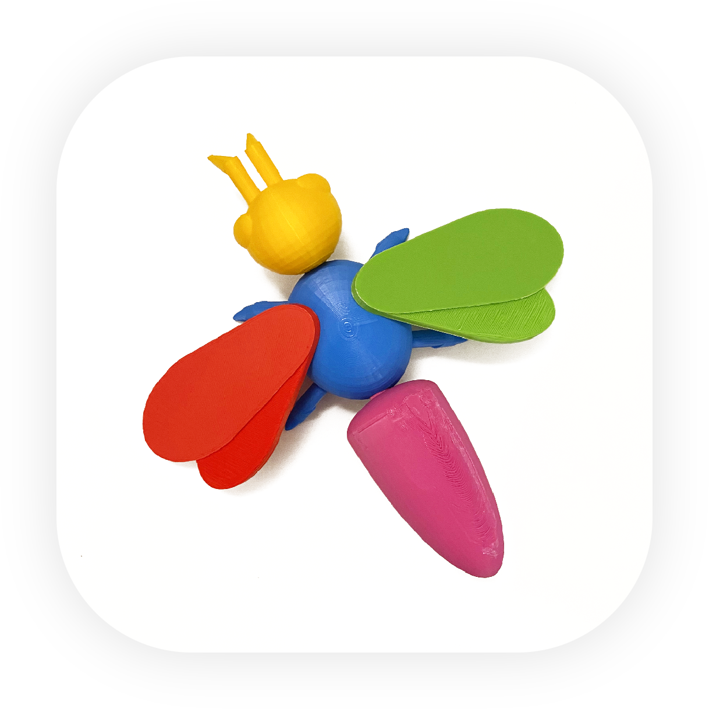

  

# Beesly

An iOS application for audibly recognising commands and providing text-to-speech feedback based on object recognition using the device's camera.

## Demos

Main Demo: [YOUTUBE LINK](https://youtu.be/TjlqPy4F1xg)

Debug Demo: [YOUTUBE LINK](https://youtube.com/watch?v=f7iVb2a4-H8?feature=share)

Main Demo (Version 1.0.1): [YOUTUBE LINK](https://youtu.be/MiDen_XEZX8)

## Commands

* **"Name"** *(States the name of the insect part you're holding + sound effect)*
* **"Information"** *(Provides information on the insect part you're holding)*
* **"What does this connect to?"** *(Provides information on what part of the insect you're holding connects to)*
* **"Completed?"** *(States whether the insect is complete or not + sound effect)*
* **"Quiz Me"** *(Begins a quiz question)*
* **"Add Label"** *(Begins recording an audio label for the insect part you're holding, sound effect indicates start and end)*
* **"Label"** *(Plays back the label you recorded for the insect part you're holding)*

## Feature Set

The application is currently capable of:

* Object detection (insect tagmata)
* Completion detection (completing when the insect is complete)
* Hold detection (detecting when you're holding part of the insect)
* Multi-hand detection (notifying you if you're using more than one hand to hold more than one part of the insect)
* Let go detection (detecting when you've let go of a specific piece and stopping any ongoing audio description of the piece being described if you do let go)
* Receiving commands via speech-to-text (speech recognition)
* Giving feedback via text-to-speech (speech synthesis)
* Hand detection (detecting the joints of any hands in frame)
* Hand pose detection (detecting when your hand performs a certain pose)
* Audio on-device recording (recording audio labels for the insect parts)
* Audio playback (local files and on-device recorded audio) 
* Speaker and VOIP audio modes (standard audio modes you find in all voice-chat apps) 
* Camera stream input (both front and back facing cameras)
* Question-and-response quiz mode that supports both auditory and visual answers
